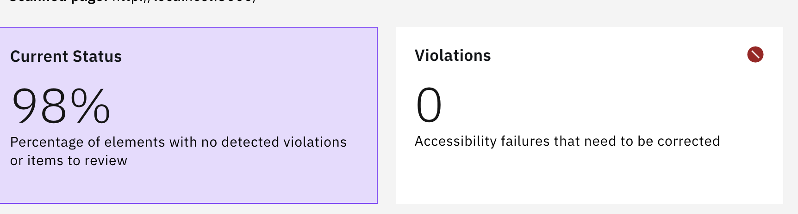
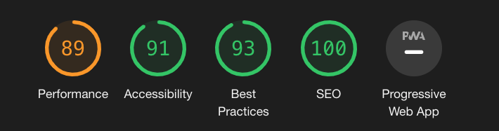

## What has been done! 
- I have added [Swiper](https://swiperjs.com/) to add slider functionalty to the application.
- successfully used [vcc-ui](https://vcc-ui.vercel.app/) to build most of the UI in the application.
- successfully added filter to be used to pick the cars based on the `bodyType`.
- I have used [FaveIcons](https://vcc-ui.vercel.app/docs/packages/favicons) and [React Helmet](https://github.com/nfl/react-helmet) to add use of Volvo FavIcons in the Header.
- Added BaseImage component using [felaJs](https://fela.js.org/) to create a general Image component so we can use it all iver the website.
- added Accessibility measurements to make our application as accessible as possible.
  
  
- Added some unite tests using react testing library.
- added some E2E tests using Cypress.
- Added GitHub Actions, to run tests before merging.

## What I was planing to do more!
- Creating our own Slider, I don't like the idea of using a ready-made plugin, it usually increases the bundle size, and not always fits the need, also in the future it might be outdated. I have created a branch `fe/build-custom-carousel` and created a prototype of it, and created a PR for it [here](https://github.com/mo-fouad/volvo-cars-challange/pull/1), I just did not have time to complete it
- Maybe using Redux or React Context API to store the data and pass it from the API to be accessible all over the application, and to make our application more organized 


# Volvo Cars (Global Online Digital) 
## Front-end coding test (React)

Our team's designer has come up with a new design to show our latest and greatest recharge cars on the website.

Here is how the design look like for desktop and mobile (files are stored under `docs` folder)

### Desktop


### Mobile


The data required to render the design is under `public/api/cars.json` folder. You need to fetch the data from the client side and render it in the browser. The data looks like this: 

```json
[
    {
      "id": "xc90-recharge",
      "modelName": "XC90 Recharge", 
      "bodyType": "suv",
      "modelType": "plug-in hybrid",
      "imageUrl": "/images/xc90_recharge.jpg"
    }
]
```

The product owner is telling you that you can generate the links to the learn and shop pages of each car by concatating the `id` of the car to the learn (`/learn/`) and shop (`/shop/`) urls.

Two extra SVG icons are also provided by our designer which are stored under `docs` folder.

## Requirements
- The project is bootstraped using create-react-app.
- Browser support is modern ever-green browsers.
- Implement this design using React and Typescript.
- Accessibility is important.
- Code Structure and reusablity is important.

## Bonus Points:
- If you use our design system component library, [VCC-UI](https://vcc-ui.netlify.app)
- If you add a filter bar on the top to filter cars by `bodyType`
